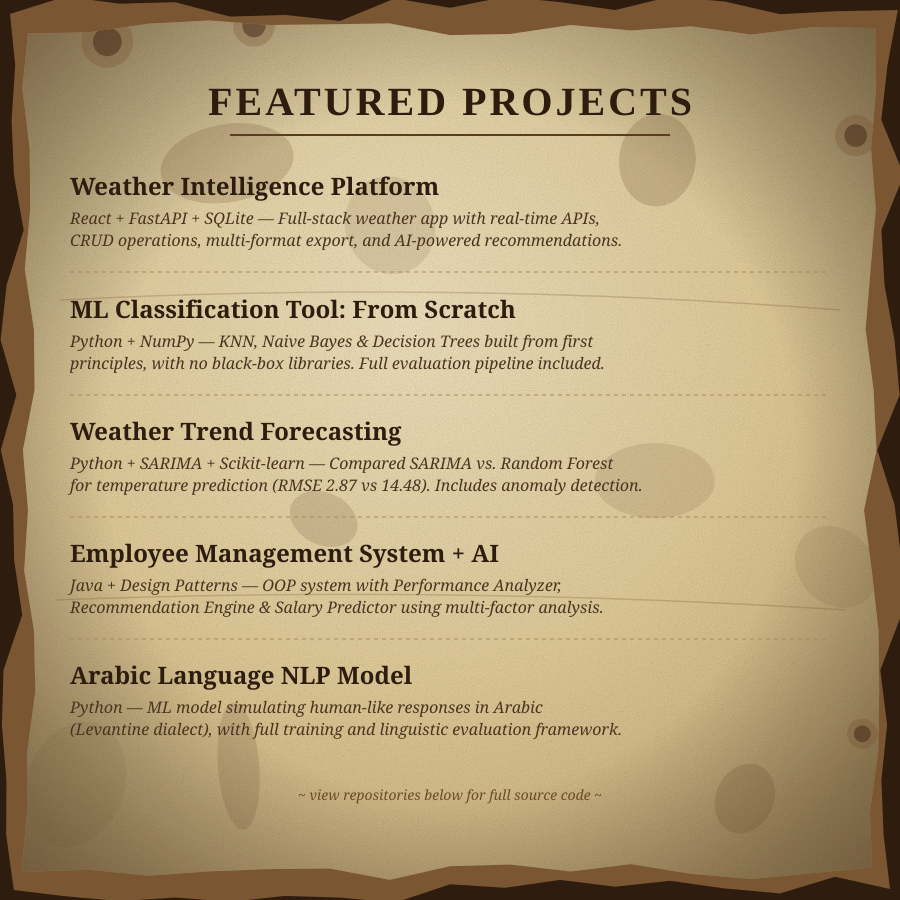

<table>
<tr>
<td width="120" align="center">

</td>
<td align="left">

**Mohammad Ismail**

AI & Data Science Undergraduate · NLP · Machine Learning · Full-Stack Development

</td>
</tr>
</table>

---

---

### 🌐 Connect with Me

---

### 💻 Tech Stack

**Programming Languages**

**Frontend & Backend**

**Data Science & Machine Learning**

**Tools & Platforms**

---

### 🎓 Certifications

---

*Build with intent. Learn in public. Make complexity feel simple.*

