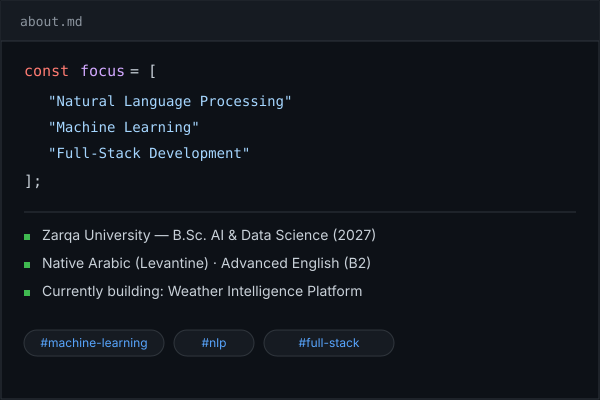

 <table>
<tr>
<td width="120" align="center">

</td>
<td align="left">

Mohammad Ismail

AI & Data Science Undergraduate · NLP · Machine Learning · Full-Stack Development

  

</td>
</tr>
</table>  

 

### 👋 About Me

<table>
<tr>
<td width="55%" valign="top">

I'm an AI & Data Science undergraduate at **Zarqa University** (expected 2027), focused on **NLP**, **Machine Learning**, and **Full-Stack Development**. I build end-to-end applications — from database design to frontend — and I'm passionate about implementing ML algorithms from first principles.

Currently building: **Weather Intelligence Platform** 🌦️

Native Arabic speaker (Levantine) · Advanced English (B2)

</td>
<td width="45%">

</td>
</tr>
</table>

---

### 🌐 Connect with Me

---

### 💻 Tech Stack

**Programming Languages**

**Frontend & Backend**

**Data Science & Machine Learning**

**Tools & Platforms**

---

### 🎓 Certifications

---

### 📊 GitHub Analytics

---

### 📌 Featured Projects
- 🌦️ **Weather Intelligence Platform** (React + FastAPI + SQLite) → [View Repo](https://github.com/MOHAMMADSMAIL/Weather-Intelligence-Platform)
- 🧠 **ML Classification Tool: Algorithms From Scratch** (Python + NumPy) → [View Repo](https://github.com/MOHAMMADSMAIL/Classification-Tool-python-project)
- 📈 **Weather Trend Forecasting** (Python + SARIMA) → [View Repo](https://github.com/MOHAMMADSMAIL/-Weather-Trend-Forecasting)
- ☕ **Employee Management System with AI Integration** (Java + Design Patterns) → [View Repo](https://github.com/MOHAMMADSMAIL/Java-OOP-Company-Management-System-with-AI-based-analysis-and-salary-prediction)
- 🗣️ **Arabic Language NLP Model** (Python) — University academic project

---

### 🎓 Education
Bachelor of Science in Artificial Intelligence & Data Science — Zarqa University (Expected 2027)

---

<i>"Any technological or managerial scheme to force documentation can be subverted by unwilling programmers." - Daniel T. Barry</i>

